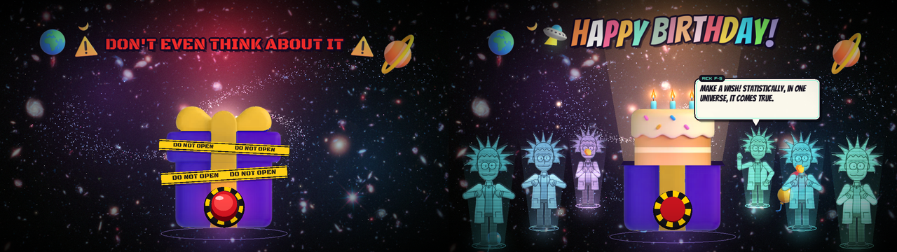

# A Piece Of Cake 🎂

A birthday surprise game made in **Processing 4 (Java mode)**.



A gift box drops into the middle of a spinning galaxy, wrapped in caution tape
and shouting **DO NOT OPEN**. It has a big red button on the front. Press it
and you get alarms, sirens and a 3-2-1 countdown, then the lid blows off and a
birthday cake with three lit candles rises out of the box. Green portals open
and six **holographic Ricks** step out, clap, and say *Happy Birthday*. After
that they take turns telling Rick jokes in comic speech boxes.

## Run it

1. Install [Processing 4](https://processing.org/download) (built and tested for **4.5.6**).
2. Unzip / download this whole `A Piece Of Cake` folder.
3. In Processing: **File → Open…** → `A Piece Of Cake/A_Piece_Of_Cake/A_Piece_Of_Cake.pde`
   (or just double-click that file). All 10 tabs open together.
4. Make sure the mode (top right) says **Java** and press **▶ Run**.

> The sketch folder inside uses underscores because Processing sketch names
> can't contain spaces. Keep the `data/` folder next to the `.pde` files, since
> all the PNGs, fonts and the hologram shader live there.

## Make it theirs

At the top of `A_Piece_Of_Cake.pde`:

```java
String BIRTHDAY_NAME = "";      // e.g. "SAM" -> "HAPPY BIRTHDAY, SAM!"
boolean FULL_SCREEN = false;    // true = fill the whole screen
boolean SOUND = true;           // synthesized sound effects + birthday tune
```

The jokes are in `Jokes.pde`. Add, remove or rewrite any line. Words wrapped in
`*stars*` (like `*burp*`) show up in green.

## Controls

| | |
|---|---|
| **Big red button** | you know you want to |
| Click the box | it wobbles. *I SAID DO NOT OPEN!* |
| Click the **cake** | blow out the candles, then make a wish |
| Click a **Rick** | he tells you another joke |
| Click empty space | fireworks |
| `SPACE` | next joke |
| `M` | mute / unmute |
| `R` | start over |
| `S` | save a screenshot to `screenshots/` |

## What's inside

| Tab | Does |
|---|---|
| `A_Piece_Of_Cake.pde` | settings, the show's timeline (warp → idle → armed → boom → party), input |
| `Space.pde` | Hubble Deep Field backdrop, spiral galaxy, parallax stars, planets, UFO / rocket fly-bys |
| `SurpriseBox.pde` | gift box, caution tape, big red button, sirens, light leaks, the lid blowing off |
| `Cake.pde` | cake rising out of the box, live candle flames, blowing them out (they're trick candles) |
| `Ricks.pde` | holographic Ricks (IK arms so they clap), who talks when, the comic speech boxes |
| `Effects.pde` | confetti, sparks, smoke, fireworks, balloons, party poppers, green portals |
| `Title.pde` | DO NOT OPEN / countdown / bouncing rainbow HAPPY BIRTHDAY |
| `Sound.pde` | claps, alarm, boom and a chiptune *Happy Birthday*, all synthesized with Java's built-in `javax.sound` |
| `data/hologram.glsl` | scanlines, flicker, glitch slices, rim light and the materialize effect |

It doesn't need any extra Processing libraries.

## Where the pictures come from

All the PNGs were sourced openly: Microsoft's **Fluent Emoji 3D** (MIT) for
the cake, gift box, balloons, party poppers and planets, and NASA's **Hubble
eXtreme Deep Field** (public domain) for the galaxy backdrop. Rick is a fan-art
drawing made by `tools/RickPartsGenerator`. Details are in
[CREDITS.md](CREDITS.md).

To rebuild the assets (optional):

```bash
pip install pillow numpy
python3 tools/prepare_assets.py      # downloads + converts the emoji, galaxy and fonts
```

…then open `tools/RickPartsGenerator/RickPartsGenerator.pde` in Processing and
press Run to redraw Rick's PNG parts.

## Troubleshooting

- **Blank window or OpenGL error.** The sketch uses the built-in `P2D`
  renderer. Update your graphics drivers, or try running it in Processing's
  *Present* mode. If your graphics card can't compile the hologram shader, the
  console says so and the Ricks are drawn as plain tinted holograms instead.
- **"The file needs to be inside a sketch folder"**: open the `.pde` that sits
  in the `A_Piece_Of_Cake` folder, and keep the folder name exactly as it is.
- **No sound.** If Java can't find an audio device, the console says so and the
  sketch runs silently. Press `M` in case it's muted.
