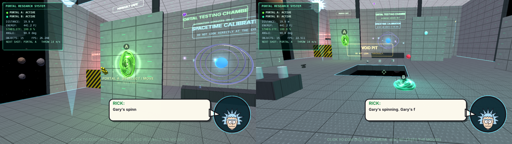

# PORTAL LAB 🌀

A Rick-and-Morty-inspired **3D portal physics sandbox** for **Processing 4.5.6
(Java mode, P3D)**. You are a floating camera with no body and no hands, inside
a huge laboratory adrift in the middle of the universe. You get a portal gun,
a pile of weird objects, and a holographic computer that does the (fictional)
spacetime maths in real time. If you stand around doing nothing, Rick notices.



- No libraries and no `data` folder: every texture, the liquid-portal shader and all
  the sounds are generated in code.
- `size(1280, 720, P3D)`.

## Run it

**Easiest (one file):** open `Portal_Lab_SingleFile/Portal_Lab_SingleFile.pde`
in Processing 4.5.6 and press **▶ Run**. You can also paste the whole file into
an empty sketch.

**Tabbed project:** open `Portal_Lab/Portal_Lab.pde`. All the tabs below open
with it.

Click inside the window to take control of the camera. **ESC** frees the mouse
without quitting.

## Controls

| Key | Action |
|---|---|
| **W A S D** | move |
| **SPACE / CTRL** | up / down |
| **SHIFT** | speed boost |
| **MOUSE** | look (arrow keys also look around) |
| **M1 (left click)** | fire a portal (shots alternate A → B → A …) / throw the held object. The portal gun is a small floating aiming device, not a weapon in your hands. |
| **E** | interact: grab the object you're looking at, select the portal you're looking at, use the matter dispenser |
| **R** / right click | release the held object |
| **Q / R** (or wheel) | rotate the selected portal |
| **Left click / right click** | confirm / cancel a portal move |
| **Wheel** | throw power (2–40 m/s) |
| **TAB** | portal research computer, full screen |
| **F3** (or **`**) | debug panel (on a Mac laptop you may need **fn + F3**) |
| **H** | hide / show the controls panel |
| **M** | mute |
| **N** | no-clip (only while debug is on) |
| **ESC** | release the mouse |

## The objects

| Object | Mass | Notes |
|---|---|---|
| NORMAL CUBE | 5 kg | boring, reliable |
| METAL BALL | 8 kg | dense, rolls far |
| ANTI-GRAVITY BALL | 2 kg | falls *up*; gravity flips every time it goes through a portal |
| UNSTABLE OBJECT | ??? | gets a random kick each jump and goes off every third one |
| QUANTUM ROCK | 4 kg | status: PROBABLY SAFE. Sometimes comes back out of the portal it went into, and tunnels short hops on its own |
| MICROVERSE BATTERY | 1.5 kg | boosts the generators when it goes through |
| ERLENMEYER FLASK | 0.6 kg | fragile |
| SMALL ROCK | 1 kg | it's a rock |
| CRASH TEST DUMMY 'GARY' | 20 kg | survived 412 tests; spins through portals |
| PICKLE | 0.3 kg | probably just a pickle |
| HYPER-ELASTIC BALL | 0.8 kg | almost perfect bounce, +12% speed per portal |
| HEAVY ANVIL | 50 kg | 50 kg of bad ideas |
| ZERO-G CORE | 2.5 kg | ignores gravity entirely |

The matter dispenser (press **E** on it) makes more, up to 12 extra objects.

## Things to try

- Put portal A on the floor and portal B on the ceiling directly above it.
  Drop anything into A and it falls forever, getting faster each loop until it
  hits the lab's speed limit.
- Put a floor portal under the anti-gravity ball. Its gravity flips every time
  it goes through.
- Throw the hyper-elastic ball through. It comes out 12% faster.
- Throw the **unstable object** through three times.
- Put portals 50+ m apart (one on a floating platform) and watch stability
  drop. Below 50%, things come out of the portal *wrong*.
- Throw the microverse battery through to boost the generators.
- Throw something through Rick's hologram.
- Open a floor portal right under Rick's hologram (with the other portal
  already placed). He goes through and has opinions about it.
- Drop the anvil on Gary, the crash-test dummy.
- Hit the matter dispenser five times in a row.
- Select a wall portal (**E**), spin it upside down with **Q / R** and lock it in.
- Mute the lab. Rick is a speech box.
- Portal-hop yourself five times in 20 seconds.
- Watch the toast after every jump: it shows the speed going **in** and coming
  **out**. Ordinary objects keep their speed exactly; the weird ones don't.
- Do nothing for 20 seconds.

## What's in each tab

| Tab | Contents |
|---|---|
| `Portal_Lab.pde` | `settings()` / `setup()` / `draw()`, the render passes, keyboard + mouse input, `markAction()` / `idleSeconds()` |
| `PlayerCamera.pde` | **PlayerCamera**: the floating viewpoint (acceleration, collision, mouse capture that works on macOS and Windows, teleporting through portals) |
| `Laboratory.pde` | **Laboratory**: every wall, floor, platform and machine as `Box` colliders (shared by drawing, collisions and raycasts), equipment, holographic signs, lights |
| `Galaxy.pde` | **Galaxy**: camera-centred sky (stars, Milky Way band, galaxies, nebulae, lit planets with rings), orbiting asteroids, cosmic dust |
| `Portal.pde` | **Portal** (frame, transforms, glow) and **PortalPair** (placement with raycast + fitting, A/B, pass-through, crossing tests, the A→B mapping) |
| `PortalLiquid.pde` | the 3D liquid-vortex look of a portal: displaced mesh, GLSL shader (with a CPU fallback), glossy rim |
| `PortalGun.pde` | **PortalGun** (visible energy projectile, impacts) and **PortalManipulator** (select / move / rotate / confirm / cancel) |
| `ThrowableObject.pde` | **ThrowableObject** (13 kinds, physics, weird teleport behaviour) and **ObjectLab** (all objects, grab/throw, dispenser) |
| `Particle.pde` | **Particles** (pooled, capped at 1400) and in-plane **Shockwave** rings |
| `PortalPhysics.pde` | **PortalPhysics** (live fictional equations) and **ResearchTerminal** (the big hologram computer and its TAB view) |
| `HUD.pde` | **HUD**: research panel, aim info, portal tags, controls, F3 debug, toasts |
| `RickDialogue.pde` | **RickDialogue**: idle timer, cartoon speech box, hologram head, every joke and event hook |
| `Sound.pde` | **Sfx**: synthesized sounds through Java's built-in `javax.sound` (no Processing Sound library needed) |
| `Assets.pde` | procedural textures and glow sprites |
| `MathUtil.pde` | small helpers |

`tools/make_single_file.py` rebuilds the single-file edition from the tabs.

## The fictional physics

The computer shows real arithmetic on live values. The portal theory itself is
made up.

```
ds² = gμν dxμ dxν                 (last jump: -(cΔt)² + Δx² + Δy² + Δz², Δt = 0 → spacelike)
E   = m c²                        (rest energy of the last thing through)
D   = √((x₂-x₁)² + (y₂-y₁)² + (z₂-z₁)²)
C   = 1 + 0.35 sin²(θ/2)          (θ = angle between the two openings)
E_portal = K × D² × C             (K = 0.9477 PJ/m²)
S   = E_available / E_required    (generators ≈ 1180 PJ, + battery boosts)
```

## Rick

If you go **20 seconds** without doing anything useful, Rick says:

> **RICK:** "Dazing off? Lazy a\*\*."

- **The timer:** it uses `millis()`, so it doesn't depend on frame rate. It
  starts over when Rick speaks and whenever you move, shoot, grab, throw, open
  the computer or move a portal. Just looking around doesn't count.
- **What he says:** the classic line comes first and every third time. Other
  idle lines fill the gaps, plus about 40 kinds of reactions to whatever weird
  experiment you're running: infinite loops, dropping things into the void
  pit, the hologram falling through a portal, Gary versus the anvil, spamming
  the dispenser, staring at a wall, flipping portals upside down, hugging one
  object for too long.
- **No spam:** each reaction has its own cooldown, and there's a shared
  6-second gap between any two lines.

## Troubleshooting

- **Mouse look doesn't turn:** click inside the window first. If your system
  blocks pointer capture, the arrow keys look around too.
- **The portal looks flatter than in the screenshots:** your GPU couldn't
  compile the liquid-portal shader. The console says so, and the CPU fallback is
  used instead.
- **No sound:** Java found no audio device. The sketch keeps running silently.
