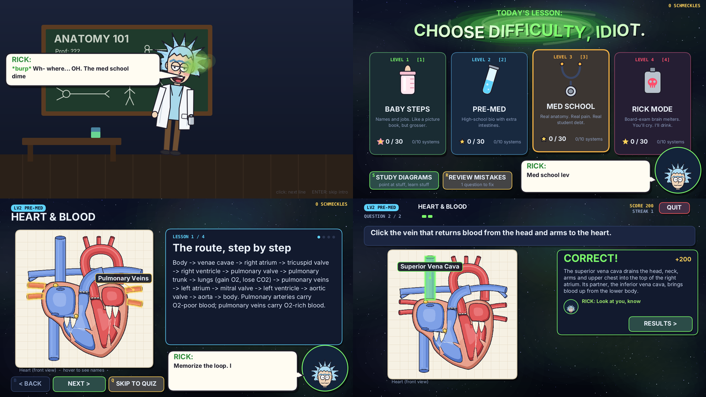

# RICK MED SCHOOL 🧪🦴

A study game for **Processing 4.5.6 (Java mode)**. Rick (the drunk, burping,
sarcastic genius scientist) portals into a lecture hall, insults you, and then
actually teaches you anatomy and physiology, from "this is a bone" all the way
up to board-exam style questions.

- No libraries and no `data` folder: every drawing and sound is made in code.
- Your progress is saved next to the sketch in `rick_med_progress.json`.

## Run it

**Easiest (one file):** open `Rick_Med_School_SingleFile/Rick_Med_School_SingleFile.pde`
in Processing 4.5.6 and press **▶ Run**.

**Tabbed project:** open `Rick_Med_School/Rick_Med_School.pde`. All the tabs
open with it.

## How it plays

1. **The intro.** A portal opens, Rick tumbles out drunk, burps, rambles, and
   drags you into *TODAY'S LESSON: CHOOSE DIFFICULTY, IDIOT.* Press **ENTER**
   to skip it.
2. **Choose a difficulty:**

   | Level | Name | What it covers |
   |---|---|---|
   | 1 | **BABY STEPS** | Names of the big parts and their main jobs |
   | 2 | **PRE-MED** | High-school / intro anatomy & physiology |
   | 3 | **MED SCHOOL** | First-year med-school detail and mechanisms |
   | 4 | **RICK MODE** | Board-exam style vignettes and mechanisms, with a 45 s clock |

3. **Pick a body system:** cells, bones, muscles, nervous system, heart &
   blood, lungs, digestion, kidneys, hormones, immune system. You can also pick
   a **random mix** or your **mistakes**.
4. **Lessons.** Rick teaches the key facts for that level, with the part
   glowing on a diagram.
5. **Quiz.**
   - **Multiple choice:** click an answer or press 1-4.
   - **Click the part:** find it on the diagram.

   Every answer shows the explanation, so a wrong answer still teaches you
   something. **H** gives a hint for half points.
6. **Results.** You get a grade, Rick's verdict, and a list of what you missed.
   Every miss goes into your **mistakes pile**. Answer a question right twice
   in REVIEW and it leaves the pile.

**Study diagrams** (from the difficulty screen) lets you explore all ten
diagrams: hover parts to learn them, press **L** to label everything, or press
**Q** for a quick "click the part" drill.

## Controls

| Key | Action |
|---|---|
| mouse | everything |
| **1-4** (or A-D) | answer |
| **SPACE / ENTER / →** | next |
| **H** | hint (half points) |
| **ESC** | back (it never quits the game) |
| **L** | labels on/off (study mode) |
| **← →** | change diagram (study mode) |
| **M** | mute |

## About the content

Ten body systems × four levels:

| System | Diagram(s) you click on |
|---|---|
| Cells | animal cell |
| Bones | skeleton |
| Muscles | major muscles (front) |
| Nervous system | neuron, brain (left side) |
| Heart & blood | heart (front section) |
| Lungs | respiratory tree |
| Digestion | digestive system |
| Kidneys | nephron, organ map |
| Hormones | organ map |
| Immune system | organ map |

That's **160 lessons**, **320 multiple-choice** and **132 click-the-part**
questions, plus study notes for all **136 diagram parts**. Each part also has
its own drill question in study mode.

Every lesson and question was written to standard anatomy and physiology
references. Then:
- a separate reviewer checked every item for accuracy, one answer per
  question, level fit and clue ambiguity, and fixed what it found;
- a final pass across all topics caught contradictions and duplicates
  between systems.

It's still a study aid, not a textbook and not medical advice. If something
matters (an exam, a patient), check it in your course material.

## What's in each tab

| Tab | Contents |
|---|---|
| `Rick_Med_School.pde` | setup / draw, scene switching with a portal wipe, input |
| `SceneIntro.pde` | the drunk portal entrance |
| `SceneMenus.pde` | difficulty and body-system menus |
| `SceneLesson.pde` | lesson cards with highlighted diagrams |
| `SceneQuiz.pde` | multiple choice + click-the-part quiz, hints, streaks, clock |
| `SceneResult.pde` | grade, verdict, missed questions |
| `SceneExplore.pde` | study diagrams + drills |
| `Rick.pde` | Rick's faces (sober / drunk / burping), body, speech box |
| `RickLines.pde` | Rick's general lines |
| `Diagram.pde`, `DiagramView.pde` | diagram + clickable-part system |
| `Dia_*.pde` | the ten anatomy diagrams |
| `Model.pde`, `Content.pde` | the study content (Content.pde is generated) |
| `Progress.pde` | saved scores and the mistakes pile |
| `Portal.pde`, `UI.pde`, `Sound.pde` | portal effect, buttons and text, synthesized sounds |

To change or add questions, edit `content/*.json` and run
`python3 tools/build_content.py`, then `python3 tools/make_single_file.py`.

## Troubleshooting

- **No sound:** Java found no audio device. The game runs silently.
- **Progress didn't save:** the sketch folder must be writable. Read-only
  folders, like some zip previews, can't save.
