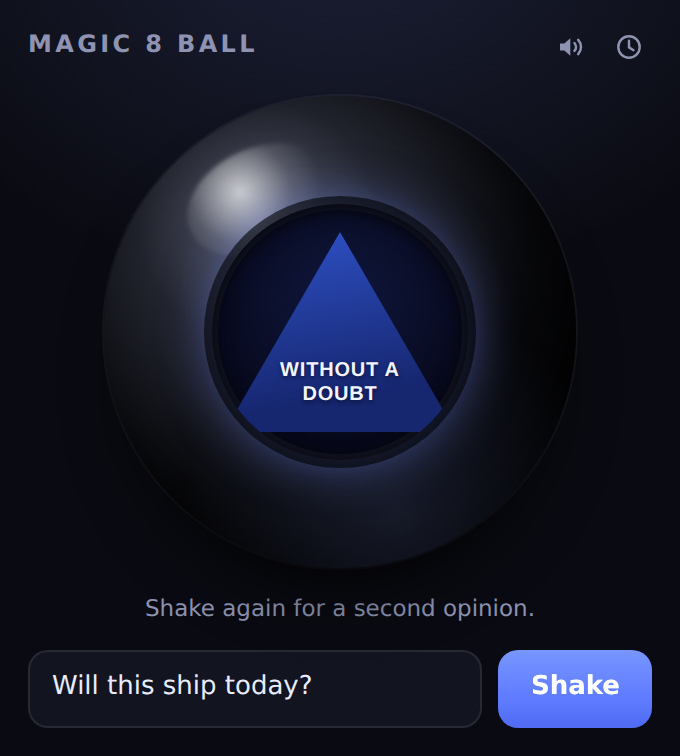

# Magic 8 Ball — Chrome extension

A Magic 8 Ball in your toolbar. Type a question, shake, get one of the 20
classic answers rising out of the ink.



## Install (unpacked)

1. Open `chrome://extensions` in Chrome, Edge, Brave or any Chromium browser.
2. Turn on **Developer mode** (top right).
3. Click **Load unpacked** and pick this `magic-8-ball-extension/` folder.
4. Pin the ball to your toolbar and click it. `Alt+Shift+8` opens it too.

## What it does

- **20 canonical answers** — 10 affirmative, 5 non-committal, 5 negative, the
  same set the Mattel ball ships with. The die is tinted by tone.
- **Fair draws.** Answers are picked with `crypto.getRandomValues` and
  rejection sampling, so all 20 are equally likely — no modulo bias. The
  previous answer never repeats back-to-back, because a repeat reads as a bug
  rather than as fate.
- **History** — the last 12 questions and answers, behind the clock button.
  Clear it any time.
- **Sound** — a shake thud and a reveal chime, synthesised with the Web Audio
  API (no audio files). Mutable, and the setting sticks.
- **Respects `prefers-reduced-motion`** — the shake animation collapses to an
  instant reveal.

## Privacy

The only permission requested is `storage`, used to keep your history and mute
setting on your own machine. There is no host permission, no content script, no
background page and no network access of any kind — nothing about your browsing
is visible to this extension, and nothing leaves your computer.

## Files

| Path | What it is |
| --- | --- |
| `manifest.json` | MV3 manifest: an action popup, `storage`, and the shortcut |
| `popup.html` / `popup.css` | The ball, drawn entirely in CSS — no images |
| `popup.js` | Answers, draw logic, shake sequencing, history, sound |
| `icons/*.png` | Toolbar icons at 16/32/48/128 |
| `tools/make_icons.py` | Regenerates those icons |

## Regenerating the icons

The icons are a ray-shaded sphere rendered by a stdlib-only script — no Pillow,
no design tool:

```sh
python3 tools/make_icons.py
```

Edit the `LIGHT` vector or `shade()` in that script to relight the ball, then
re-run it to rewrite all four sizes.
